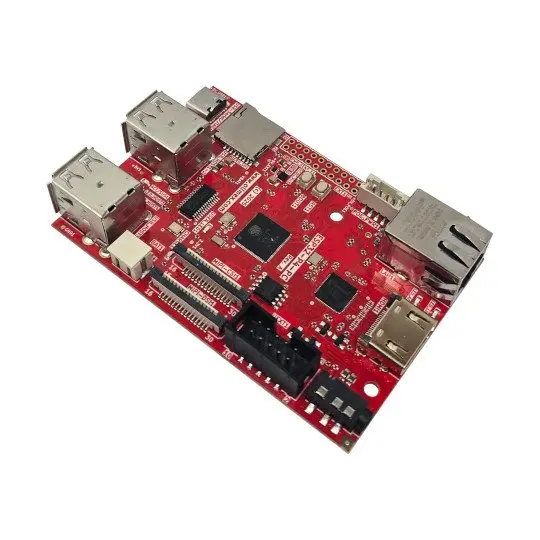

> :warning: This is **No Graphical Library version** of olimex_esp32_p4_pc BSP. If you want to use this BSP with LVGL use olimex_esp32_p4_pc component.

# BSP: Olimex ESP32-P4-PC

## Overview

<table>
<tr><td>

ESP32-P4-PC is a development board from Olimex, very close to upstream ESP32-P4-Function-EV-Board.
Based on the ESP32-P4 chip, featuring a dual-core 400 MHz RISC-V processor bundled with with 32 MB PSRAM. In addition, ESP32-P4 supports USB 2.0 specification, MIPI-CSI/DSI, H264 Encoder, and various other peripherals.

</td><td width="200">
  
</td></tr>
</table>

## Configuration

Configuration in `menuconfig`.

Selection LCD display `Olimex ESP32-P4-PC BSP --> Display --> Select HDMI resolution`
    - 800x600@60HZ
    - 1280x720@60HZ
    - 1280x800@60HZ
    - 1920x1080@30HZ

## HDMI Support

This BSP supports HDMI converter Lontium LT8912B. Follow these rules for using it with HDMI:
- Use ESP-IDF 5.4 or older (from commit [93fdbf2](https://github.com/espressif/esp-idf/commit/93fdbf25b3ea7e44d1f519ed61050847dcc8a076))
- Only RGB888 is supported with HDMI
- Use MIPI-DSI to HDMI converter Lontium LT8912B

## Capabilities and dependencies

<!-- START_DEPENDENCIES -->

|     Available    |       Capability       |     Controller/Codec     |                                                                                                                                                         Component                                                                                                                                                        |                            Version                           |
|------------------|------------------------|--------------------------|--------------------------------------------------------------------------------------------------------------------------------------------------------------------------------------------------------------------------------------------------------------------------------------------------------------------------|--------------------------------------------------------------|
|:heavy_check_mark:|     :pager: DISPLAY    |lt8912b|idf [espressif/esp_lcd_lt8912b](https://components.espressif.com/components/espressif/esp_lcd_lt8912b)|>=5.4 >=2.0.1,<3.0.0 >=1.0.3,<2.0.0 >=0.1.3,<1.0.0|
| :x: |:black_circle: LVGL_PORT|                          |                                                                                                                                                                                                                                                                                                                          |                                                              |
|        :x:       | :radio_button: BUTTONS |                          |                                                                                                                                                                                                                                                                                                                          |                                                              |
|:heavy_check_mark:|  :musical_note: AUDIO  |                          |                                                                                                              [espressif/esp_codec_dev](https://components.espressif.com/components/espressif/esp_codec_dev)                                                                                                              |                             ~1.5                             |
|:heavy_check_mark:| :speaker: AUDIO_SPEAKER|          es8311          |                                                                                                                                                                                                                                                                                                                          |                                                              |
|:heavy_check_mark:| :microphone: AUDIO_MIC |          es8311          |                                                                                                                                                                                                                                                                                                                          |                                                              |
|:heavy_check_mark:|  :floppy_disk: SDCARD  |                          |                                                                                                                                                            idf                                                                                                                                                           |                             >=5.4                            |
|        :x:       |    :video_game: IMU    |                          |                                                                                                                                                                                                                                                                                                                          |                                                              |
|:heavy_check_mark:|     :camera: CAMERA    |      OV5647, SC2336      |                                                                                                                  [espressif/esp_video](https://components.espressif.com/components/espressif/esp_video)                                                                                                                  |                             ~2.0                             |

<!-- END_DEPENDENCIES -->

## Compatible BSP Examples

<!-- START_EXAMPLES -->

| Example | Description | Try with ESP Launchpad |
| ------- | ----------- | ---------------------- |
| [Display Rotation Example](https://github.com/espressif/esp-bsp/tree/master/examples/display_rotation) | Rotate screen using buttons or an accelerometer (`BSP_CAPS_IMU`, if available) | [Flash Example](https://espressif.github.io/esp-launchpad/?flashConfigURL=https://espressif.github.io/esp-bsp/config.toml&app=display_rotation-) |
| [Display SD card Example](https://github.com/espressif/esp-bsp/tree/master/examples/display_sdcard) | Example of mounting an SD card using SD-MMC/SPI with display interaction. This example is also supported on boards without a display. | [Flash Example](https://espressif.github.io/esp-launchpad/?flashConfigURL=https://espressif.github.io/esp-bsp/config.toml&app=display_sdcard) |

<!-- END_EXAMPLES -->

<!-- START_BENCHMARK -->

<!-- END_BENCHMARK -->
